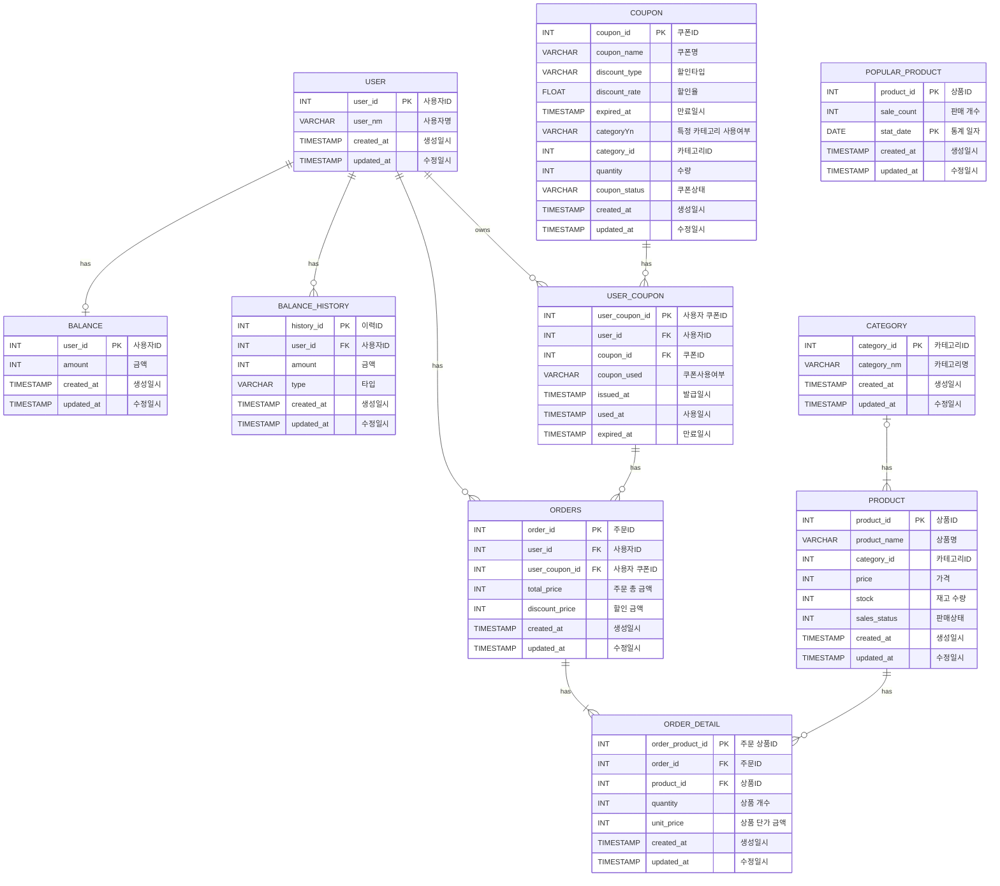

##ERD

```mermaid
erDiagram
    USER ||--o| BALANCE : has
    USER ||--o{ BALANCE_HISTORY : has
    USER ||--o{ USER_COUPON: owns
    USER ||--o{ ORDERS: has
    COUPON ||--o{ USER_COUPON: has
    USER_COUPON ||--o{ ORDERS: has
    ORDERS ||--|{ ORDER_DETAIL: has
    PRODUCT ||--o{ ORDER_DETAIL: has
    CATEGORY |o--|{ PRODUCT: has

    USER {
        INT user_id PK "사용자ID"
        VARCHAR user_nm "사용자명"
        TIMESTAMP created_at "생성일시"
        TIMESTAMP updated_at "수정일시"
    }

    BALANCE {
        INT user_id PK "사용자ID"
        INT amount "금액"
        TIMESTAMP created_at "생성일시"
        TIMESTAMP updated_at "수정일시"
    }

    BALANCE_HISTORY{
        INT history_id PK "이력ID"
        INT user_id FK "사용자ID"
        INT amount "금액"
        VARCHAR type "타입"
        TIMESTAMP created_at "생성일시"
        TIMESTAMP updated_at "수정일시"
    }

    COUPON {
        INT coupon_id PK "쿠폰ID"
        VARCHAR coupon_name "쿠폰명"
        VARCHAR discount_type "할인타입"
        FLOAT discount_rate "할인율"
        TIMESTAMP expired_at "만료일시"
        VARCHAR categoryYn "특정 카테고리 사용여부"
        INT category_id "카테고리ID"
        INT quantity "수량"
        VARCHAR coupon_status "쿠폰상태"
        TIMESTAMP created_at "생성일시"
        TIMESTAMP updated_at "수정일시"
    }

    USER_COUPON {
        INT user_coupon_id PK "사용자 쿠폰ID"
        INT user_id FK "사용자ID"
        INT coupon_id FK "쿠폰ID"
        VARCHAR coupon_used "쿠폰사용여부"
        TIMESTAMP issued_at "발급일시"
        TIMESTAMP used_at "사용일시"
        TIMESTAMP expired_at "만료일시"
    }

    PRODUCT {
        INT product_id PK "상품ID"
        VARCHAR product_name "상품명"
        INT category_id "카테고리ID"
        INT price "가격"
        INT stock "재고 수량"
        INT sales_status "판매상태"
        TIMESTAMP created_at "생성일시"
        TIMESTAMP updated_at "수정일시"
    }

    CATEGORY {
        INT category_id PK "카테고리ID"
        VARCHAR category_nm "카테고리명"
        TIMESTAMP created_at "생성일시"
        TIMESTAMP updated_at "수정일시"
    }

    ORDERS {
        INT order_id PK "주문ID"
        INT user_id FK "사용자ID"
        INT user_coupon_id FK "사용자 쿠폰ID"
        INT total_price "주문 총 금액"
        INT discount_price "할인 금액"
        TIMESTAMP created_at "생성일시"
        TIMESTAMP updated_at "수정일시"
    }

    ORDER_DETAIL {
        INT order_product_id PK "주문 상품ID"
        INT order_id FK "주문ID"
        INT product_id FK "상품ID"
        INT quantity "상품 개수"
        INT unit_price "상품 단가 금액"
        TIMESTAMP created_at "생성일시"
        TIMESTAMP updated_at "수정일시"
    }

    POPULAR_PRODUCT {
        INT product_id PK "상품ID"
        INT sale_count "판매 개수"
        DATE stat_date PK "통계 일자"
        TIMESTAMP created_at "생성일시"
        TIMESTAMP updated_at "수정일시"
    }
```