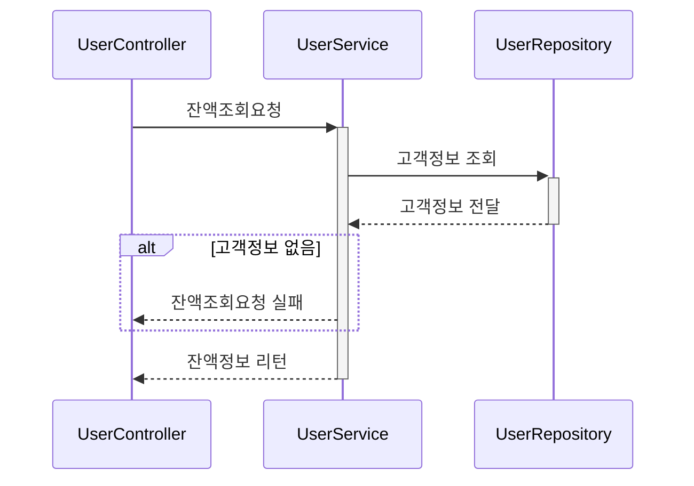
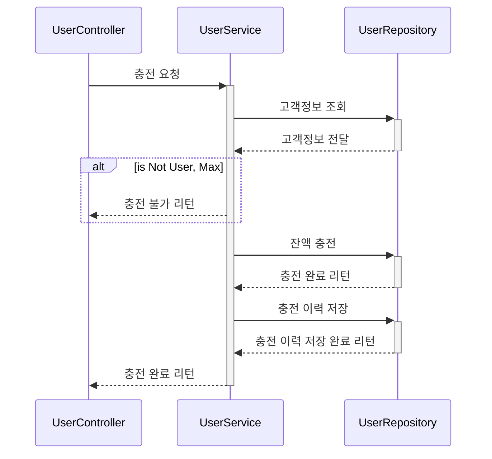
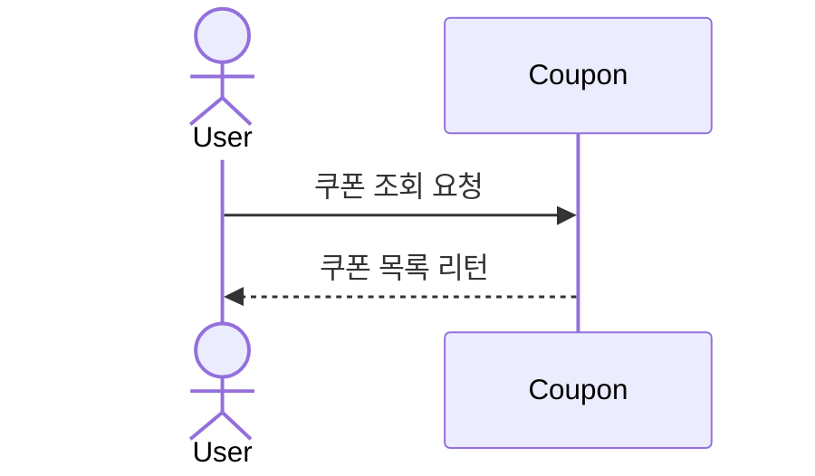
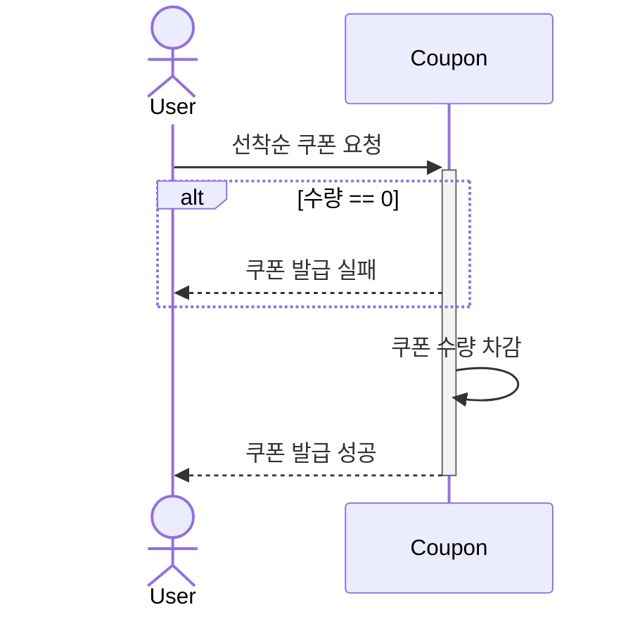
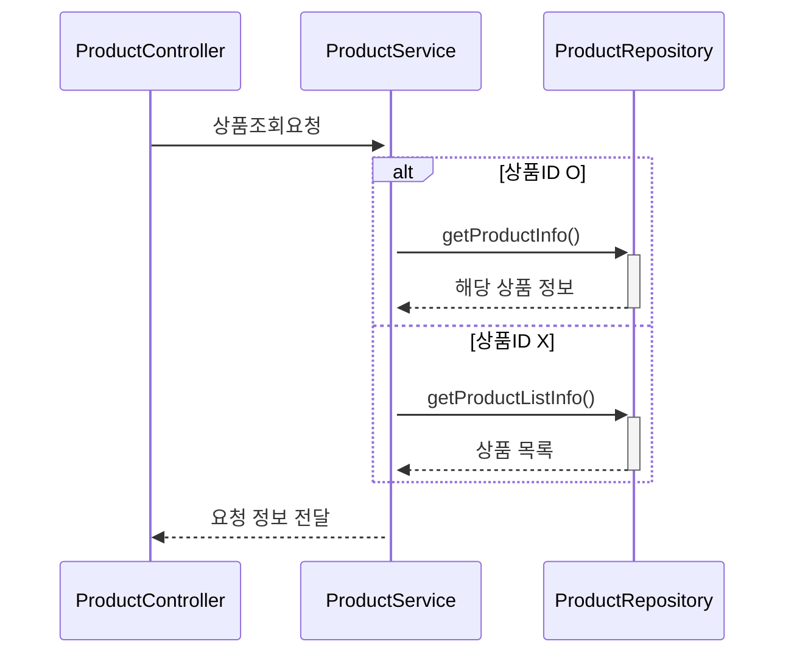
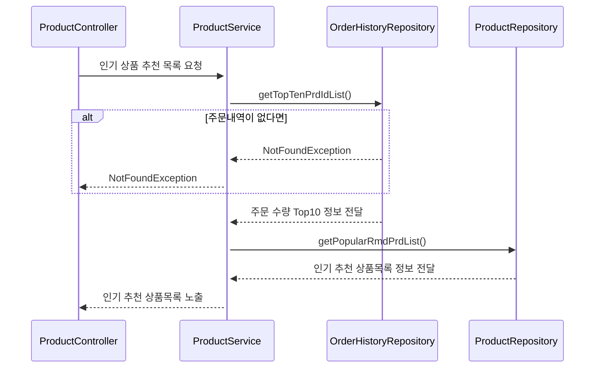
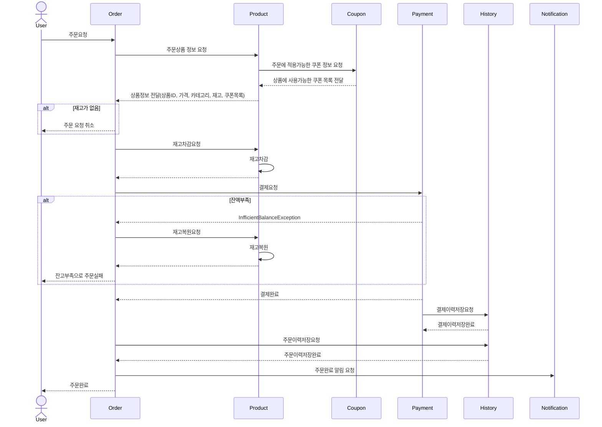
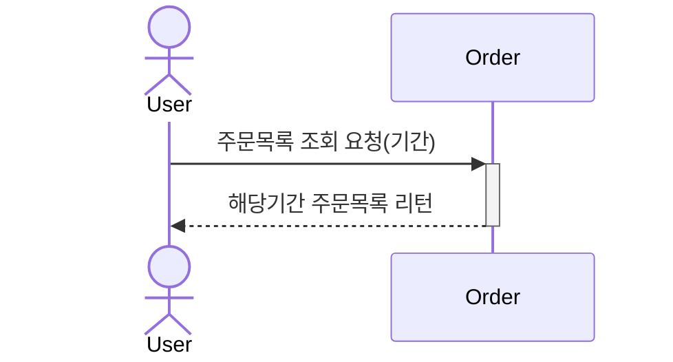
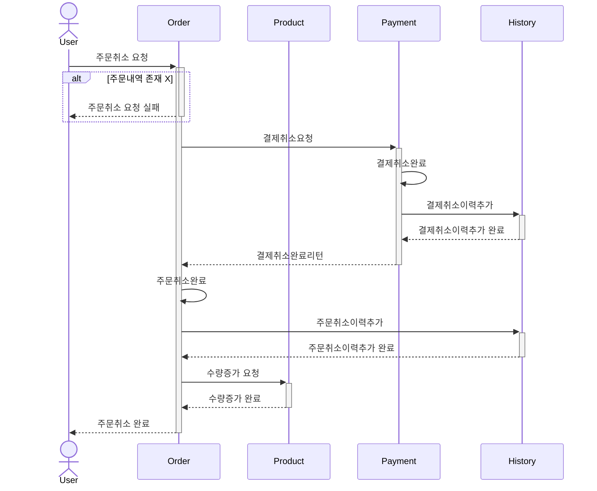

## 잔액 조회 시퀀스 다이어그램

```mermaid
sequenceDiagram
    UserController->>+UserService: 잔액조회요청
    UserService->>+UserRepository: 고객정보 조회
    UserRepository-->>-UserService: 고객정보 전달
    alt 고객정보 없음
        UserService-->>UserController: 잔액조회요청 실패
    end
    UserService-->>-UserController: 잔액정보 리턴
```

## 잔액 충전 시퀀스 다이어그램

```mermaid
sequenceDiagram
    UserController->>+UserService: 충전 요청
    UserService->>+UserRepository: 고객정보 조회
    UserRepository-->>-UserService: 고객정보 전달
    alt is Not User, Max
        UserService-->>UserController: 충전 불가 리턴
    end
    UserService->>+UserRepository: 잔액 충전
    UserRepository-->>-UserService: 충전 완료 리턴
    UserService->>+UserRepository: 충전 이력 저장
    UserRepository-->>-UserService: 충전 이력 저장 완료 리턴
    UserService-->>-UserController: 충전 완료 리턴
```

## 쿠폰 조회 시퀀스 다이어그램

```mermaid
sequenceDiagram
    actor User as User
    participant Coupon as Coupon
    User->>Coupon: 쿠폰 조회 요청
    Coupon-->>User: 쿠폰 목록 리턴
```

## 쿠폰 발급 시퀀스 다이어그램

```mermaid
sequenceDiagram
  actor User as User
  participant Coupon as Coupon
  
  User ->>+ Coupon: 선착순 쿠폰 요청
  alt 수량 == 0
    Coupon -->> User: 쿠폰 발급 실패
  end
  Coupon ->> Coupon: 쿠폰 수량 차감
  Coupon -->>- User: 쿠폰 발급 성공
```
## 상품 조회 시퀀스 다이어그램

```mermaid
sequenceDiagram
    participant ProductController
    participant ProductService
    participant ProductRepository
    ProductController->>+ProductService:상품조회요청
    alt 상품ID O
    ProductService->>+ProductRepository:getProductInfo()
    ProductRepository-->>-ProductService:해당 상품 정보
    else 상품ID X
    ProductService->>+ProductRepository:getProductListInfo()
    ProductRepository-->>-ProductService:상품 목록
    end
    ProductService-->>ProductController: 요청 정보 전달
```

## 인기 상품 조회 시퀀스 다이어그램

```mermaid
sequenceDiagram
    ProductController->>+ProductService: 인기 상품 추천 목록 요청
    ProductService->>OrderHistoryRepository: getTopTenPrdIdList()
    alt 주문내역이 없다면 
        OrderHistoryRepository-->>ProductService: NotFoundException
        ProductService-->>ProductController: NotFoundException
    end
    OrderHistoryRepository-->>ProductService: 주문 수량 Top10 정보 전달
    ProductService->>ProductRepository: getPopularRmdPrdList()
    ProductRepository-->>ProductService: 인기 추천 상품목록 정보 전달
    ProductService-->>ProductController: 인기 추천 상품목록 노출
```

## 주문 시퀀스 다이어그램

```mermaid
sequenceDiagram
    actor User
    participant Order as Order
    participant Product as Product
    participant Coupon as Coupon
    participant Payment as Payment
    participant History as History
    participant Notification as Notification
    User->>Order: 주문요청
    Order->>Product: 주문상품 정보 요청
    Product->>Coupon: 주문에 적용가능한 쿠폰 정보 요청
    Coupon-->>Product: 상품에 사용가능한 쿠폰 목록 전달
    Product-->>Order: 상품정보 전달(상품ID, 가격, 카테고리, 재고, 쿠폰목록)
    alt 재고가 없음
        Order-->>User: 주문 요청 취소
    end
    Order->>Product: 재고차감요청
    Product->>Product:재고차감
    Product-->>Order: 
    Order->>Payment: 결제요청
    alt 잔액부족
        Payment-->>Order: InfficientBalanceException
        Order->>Product: 재고복원요청
        Product->>Product: 재고복원
        Product-->>Order: 
        Order-->>User: 잔고부족으로 주문실패
    end
    Payment-->>Order: 결제완료
    Payment->>History: 결제이력저장요청
    History-->>Payment: 결제이력저장완료
    Order->>History: 주문이력저장요청
    History-->>Order: 주문이력저장완료
    Order->>Notification: 주문완료 알림 요청
    Order-->>User: 주문완료
```

## 주문 조회 시퀀스 다이어그램

```mermaid
sequenceDiagram
    actor User
    participant Order as Order
    User->>+Order: 주문목록 조회 요청(기간)
    Order-->>-User: 해당기간 주문목록 리턴
```

## 주문 취소 시퀀스 다이어그램

```mermaid
sequenceDiagram
    actor User
    participant Order as Order
    participant Product as Product
    participant Payment as Payment
    participant History as History
    User->>+Order: 주문취소 요청
    Activate Order
    alt 주문내역 존재 X
        Order-->>User: 주문취소 요청 실패
        Deactivate Order
    end
    Order->>+Payment: 결제취소요청
    Payment->>Payment: 결제취소완료
    Payment->>+History: 결제취소이력추가
    History-->>-Payment: 결제취소이력추가 완료
    Payment-->>-Order: 결제취소완료리턴
    Order->>Order: 주문취소완료
    Order->>+History: 주문취소이력추가
    History-->>-Order: 주문취소이력추가 완료
    Order->>+Product: 수량증가 요청
    Product-->>-Order: 수량증가 완료
    Order-->>-User: 주문취소 완료
```
    
